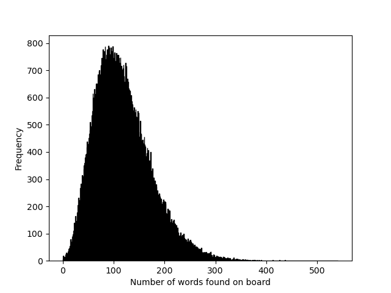

# Boggle Solver
Was board, and playing boggle... so I wrote this.

`python boggle.py solve -n 1000` to run 1000 boards and get their soluitons.

`python boggle.py results` to read the results.


# Results of 100,000 boards run
Histogram 

## Worst borad:
found 0 solutions: []
```
p n m n
s l b d
r l h t
t d s h
```


## Best board

```
h l e m
s t a e
u n i v
o d e l
```

found 542 solutions
```
aid, aide, aiel, ail, aile, aint, ainu, ait, ale, alee, alem, alt, altin, altun, ame, and, ande, andi, ani, anil, anile, anode, anous, ansu, ant, ante, anti, antu, anus, ate, ati, atle, atlee, atune, ave, avenous, avens, avid, avidous, avine, deino, del, delia, delian, delint, delve, den, denat, denial, dent, dental, dentale, dentel, dentil, dev, deva, deviant, deviate, devil, dial, dian, diane, die, diem, din, dine, dint, dinus, dit, dita, dital, dite, div, diva, divan, dive, divel, don, donal, donate, donatee, donative, done, donia, dont, dout, dun, dunal, dune, dunite, duns, dunst, dunt, duo, dush, dust, dustee, dustin, ean, eat, eats, eave, eaved, edit, edital, edith, edna, edo, edoni, eel, eident, elain, elaine, eland, elanus, elatine, elative, eli, elia, elian, elite, els, elt, elvan, elvanite, eme, emetine, enam, enamel, enate, end, endite, endive, enid, ens, enslave, entail, ental, entame, entelam, entia, eta, etna, etude, eva, evan, eve, evea, evelina, even, evens, event, evident, evil, ian, ianus, ide, ido, ind, inde, indus, ino, insteam, ita, itea, item, its, iva, ivan, laet, laeti, lai, laid, lain, laine, lam, lame, lan, land, lane, lant, lat, late, lath, latin, latinus, latus, lave, lavenite, lea, leam, lean, leant, leat, leath, leave, leaved, leaven, leavenous, led, lee, lei, leith, leman, len, lena, lend, lendu, leno, lens, lent, lenth, let, lev, levant, levee, levi, levin, levite, lid, lide, lie, lied, lien, lienal, lieve, lin, lina, lindo, line, lined, lino, linous, lint, lintel, linus, lit, lite, lith, litus, liv, live, lived, liven, mae, maid, maiden, maidu, mail, mailed, main, maine, mains, maint, mal, male, malt, man, mand, mande, mandil, mane, maned, manei, mani, manid, mano, mans, mant, mantel, mantid, mantle, manus, mat, mate, math, matin, mats, matsu, meal, mean, meant, meat, meet, meile, mein, meith, mel, mela, melano, melanous, melt, met, meta, metal, metin, mev, nae, nael, naid, nail, naive, nam, name, nat, nate, native, nave, navel, navite, ned, nei, neil, neve, nid, nide, nidus, nieve, nil, nile, nit, nival, nod, node, nodi, nodus, nou, nous, nth, nude, nut, ode, odel, odin, ona, one, ons, ontal, onus, oust, out, outlaid, outland, outlean, outname, sla, slae, slain, slainte, slait, slam, slane, slant, slat, slate, slath, slav, slave, slaved, slavi, sleave, sleaved, slee, sleeve, sleeved, snail, snath, sned, snide, snite, snivel, snod, snout, staid, stain, stale, stam, stan, stand, standel, stane, stave, steal, steam, stean, steeve, stela, stelae, stelai, stem, stema, stid, stile, stine, stive, stu, stud, stude, studia, stun, sud, sun, sundial, sune, sunil, sunt, sutile, tae, tael, tai, tail, tailed, tain, taino, tal, tale, tam, tame, tan, tane, tano, tav, tave, tea, teal, team, tean, tee, teem, tema, teman, tiam, tid, tide, tie, tied, tien, til, tile, tiled, tin, tina, tind, tine, tined, tino, tsun, tudel, tun, tuna, tund, tune, tuned, tuno, tush, udi, udo, una, unal, unde, undelve, undevil, undo, unevil, uniat, uniate, unie, unit, unital, unite, unode, unslate, unslave, unsleaved, unsleeve, unsleeved, unstaid, unstaved, untailed, untame, unteam, unteem, untie, untied, until, untile, untiled, ush, ust, uta, utai, ute, utile, utinam, vai, vail, vain, val, vale, valet, van, vane, vaned, vat, veal, vee, vei, veil, veiled, vein, veinal, veined, veinous, venal, vend, venial, venie, venite, venous, vent, ventail, ventil, venus, via, vial, viand, vie, vile, vina, vinal, vine, vined, vino, vinod, vinous, vint, vinta, vintem, vita, vital, vitals, vlei
```

